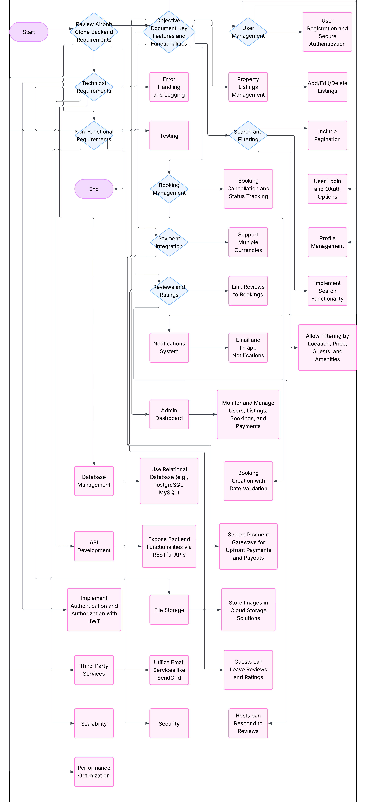

# Features and Functionalities of the Airbnb Clone Backend

## Objective:
This document outlines the key features and functionalities required for the **Airbnb Clone backend**. These features align with the backend requirements to build a scalable, secure, and robust rental marketplace platform.

##  **Introduction to Project Requirements**
Backend development for the Airbnb Clone focuses on creating server-side logic, managing databases, and integrating APIs to power the application. The key features and functionalities required for this backend are categorized into **Core Functionalities**, **Technical Requirements**, and **Non-Functional Requirements**.

## **Core Functionalities**

### 1. **User Management**
   - **User Registration**: Allow users to sign up as guests or hosts. Implement secure authentication methods (JWT).
   - **User Login & Authentication**: Support email/password login and OAuth options (Google/Facebook).
   - **Profile Management**: Allow users to update profile information (photos, contact info).

### 2. **Property Listings Management**
   - **Add Listings**: Hosts can create property listings by providing details like title, description, location, price, amenities, and availability.
   - **Edit/Delete Listings**: Hosts can update or remove their listings.

### 3. **Search and Filtering**
   - Implement search filters for properties based on location, price range, number of guests, amenities, etc.
   - Include pagination for large datasets.

### 4. **Booking Management**
   - **Booking Creation**: Guests can book properties for specific dates, with date validation to prevent double bookings.
   - **Booking Cancellation**: Allow guests or hosts to cancel bookings based on the cancellation policy.
   - **Booking Status**: Track booking statuses like pending, confirmed, or completed.

### 5. **Payment Integration**
   - Integrate secure payment gateways (Stripe, PayPal) for upfront guest payments and automatic payouts to hosts.
   - Support for multiple currencies.

### 6. **Reviews and Ratings**
   - Guests can leave reviews and ratings for properties, and hosts can respond.
   - Reviews should be tied to specific bookings to avoid abuse.

### 7. **Notifications System**
   - Implement notifications for booking confirmations, cancellations, and payment updates (via email and in-app).

### 8. **Admin Dashboard**
   - Create an admin interface to manage users, listings, bookings, and payments.

##  **Technical Requirements**

### 1. **Database Management**
   - Use a relational database (PostgreSQL or MySQL).
   - Key tables: Users (guests/hosts), Properties, Bookings, Reviews, Payments.

### 2. **API Development**
   - Implement RESTful APIs with proper HTTP methods (GET, POST, PUT, DELETE).
   - Consider using GraphQL for complex queries.

### 3. **Authentication & Authorization**
   - Implement JWT for secure user sessions.
   - Use role-based access control (RBAC) for guests, hosts, and admins.

### 4. **File Storage**
   - Store images and files on cloud services like AWS S3 or Cloudinary.

### 5. **Third-Party Services**
   - Integrate email services (SendGrid/Mailgun).

### 6. **Error Handling & Logging**
   - Implement global error handling and logging for the API.

##  **Non-Functional Requirements**

### 1. **Scalability**
   - Modular architecture for horizontal scaling with load balancers.

### 2. **Security**
   - Encrypt sensitive data (passwords, payment info).
   - Implement firewalls and rate limiting.

### 3. **Performance Optimization**
   - Use caching tools like Redis.
   - Optimize database queries for better performance.

### 4. **Testing**
   - Implement unit and integration tests (e.g., pytest).
   - Include automated API testing.

##  **Diagram of Features and Functionalities**
The following diagram outlines the features and interactions between the core components of the backend system:dig

