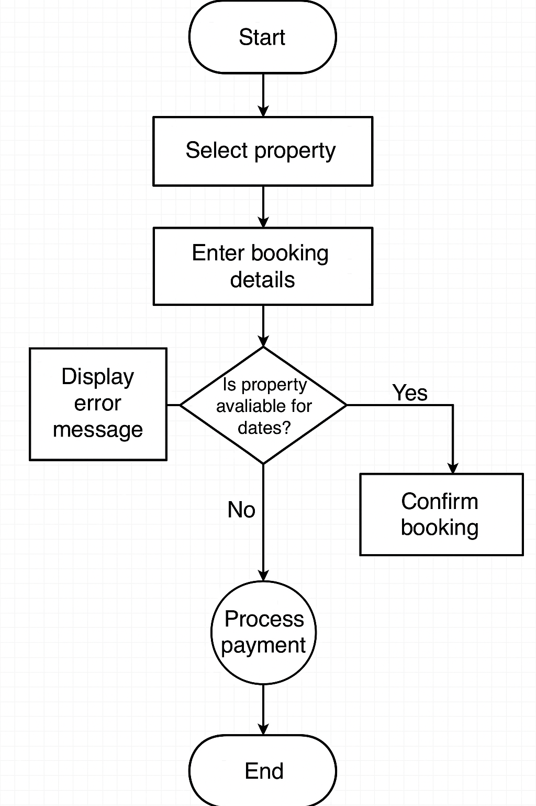

# Flowchart Backend

## Selected Process: Property Booking

The flowchart illustrates the end-to-end process of **property booking**, starting from a guest selecting a listing to confirming the booking and triggering backend updates like payment processing and availability updates.

## 🔍 Key Workflow Steps
1. Guest searches for a property using filters.
2. Guest selects an available property.
3. System checks availability and date conflicts.
4. Guest submits booking request.
5. System processes the request:
   - Validates input
   - Reserves selected dates
   - Processes payment
6. Booking is confirmed or rejected.
7. Notifications are sent to both guest and host.

┌───────────┐
│   Start   │
└─────┬─────┘
      │
      ▼
┌───────────────────────┐
│ Guest searches for    │
│ property using filters│
└───────┬───────────────┘
        │
        ▼
┌───────────────────────┐
│ Guest selects         │
│ available property    │
└───────┬───────────────┘
        │
        ▼
┌───────────────────────┐
│ System checks         │
│ availability & dates  │
└───────┬───────────────┘
        │
        ├───────────┐
        ▼           ▼
┌─────────────┐  ┌─────────────┐
│   Available │  │ Not Available
└─────┬───────┘  └─────┬───────┘
      │                 │
      ▼                 ▼
┌───────────────────────┐
│ Guest submits         │
│ booking request       │
└───────┬───────────────┘
        │
        ▼
┌───────────────────────┐
│ System validates      │
│ input data            │
└───────┬───────────────┘
        │
        ├───────────┐
        ▼           ▼
┌─────────────┐  ┌─────────────┐
│  Valid      │  │  Invalid    │
└─────┬───────┘  └─────┬───────┘
      │                 │
      ▼                 ▼
┌───────────────────────┐
│ Reserve selected dates│
└───────┬───────────────┘
        │
        ▼
┌───────────────────────┐
│ Process payment       │
│ through gateway       │
└───────┬───────────────┘
        │
        ├───────────┐
        ▼           ▼
┌─────────────┐  ┌─────────────┐
│  Success    │  │  Failure    │
└─────┬───────┘  └─────┬───────┘
      │                 │
      ▼                 ▼
┌───────────────────────┐
│ Confirm booking &     │
│ update databases      │
└───────┬───────────────┘
        │
        ▼
┌───────────────────────┐
│ Send notifications to │
│ guest and host        │
└───────┬───────────────┘
        │
        ▼
┌───────────┐
│   End     │
└───────────┘

## 🖼️ Diagram

